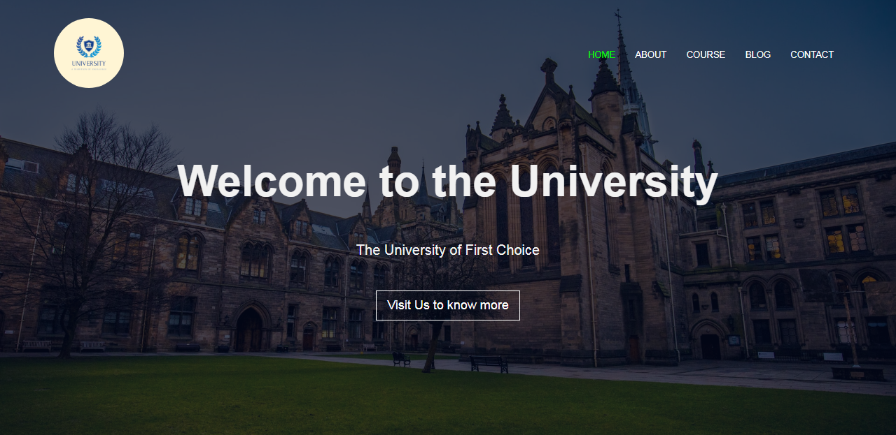

### University Website

#### This a static website for a university platform, containing 5 webpages, a contact form, embedded google map, a slide in animation and more

#### Built with Html, CSS and JavaScript

#### Link to the live website: [University Website](https://mystifying-kepler-76ddea.netlify.app/ "University live site")

#### Design Image
#### Desktop View

#### Credits: Easy tutorials on Youtube [Easy tutorials](https://www.youtube.com/c/EasyTutorialsVideo?sub_confirmation=1 "Easy tutorials live site")